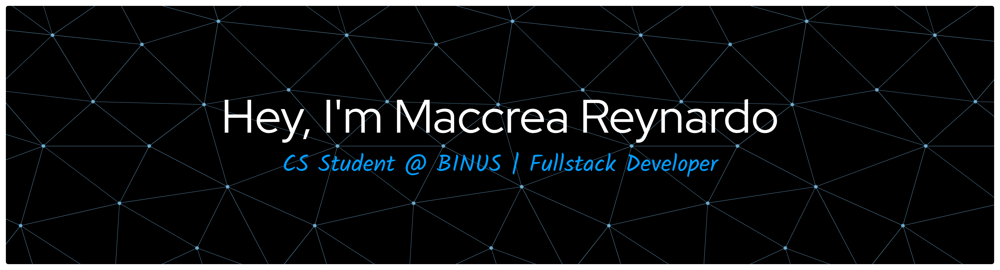

# 💫 About Me:
🎓 Computer Science student at BINUS University.  📱 Building seamless mobile experiences with React Native & Expo.  💻 Crafting fast, modern web interfaces using Next.js and Tailwind CSS.  ⚙️ Architecting robust backend APIs and automation bots with Node.js, Python, and Supabase.  🐧 Linux enthusiast (Ubuntu) exploring local AI deployments and system optimizations.

## 🌐 Socials:
   

# 💻 Tech Stack:
                       
# 📊 GitHub Stats:
 
 

### ✍️ Random Dev Quote

<!-- 

  

###

<h1 data-importer="text" align="center">Hey 👋What's Up?</h1>

###

  
  
  
  
  
  
  
  
  
  
  
  
  
  
  
  
  
  
  
  
  
  
  
  
  
  
  
  
  
  
  
  
  
  
  
  
  
  
  
  
  

###

  
  
  
  

###

  
  

###

<picture data-importer="pacman">
  <source media="(prefers-color-scheme: dark)" srcset="https://raw.githubusercontent.com/maccrea/maccrea/pacman-output/pacman-contribution-graph-dark.svg?game=pacman">
  <source media="(prefers-color-scheme: light)" srcset="https://raw.githubusercontent.com/maccrea/maccrea/pacman-output/pacman-contribution-graph.svg?game=pacman">
  
</picture>

###

### -->